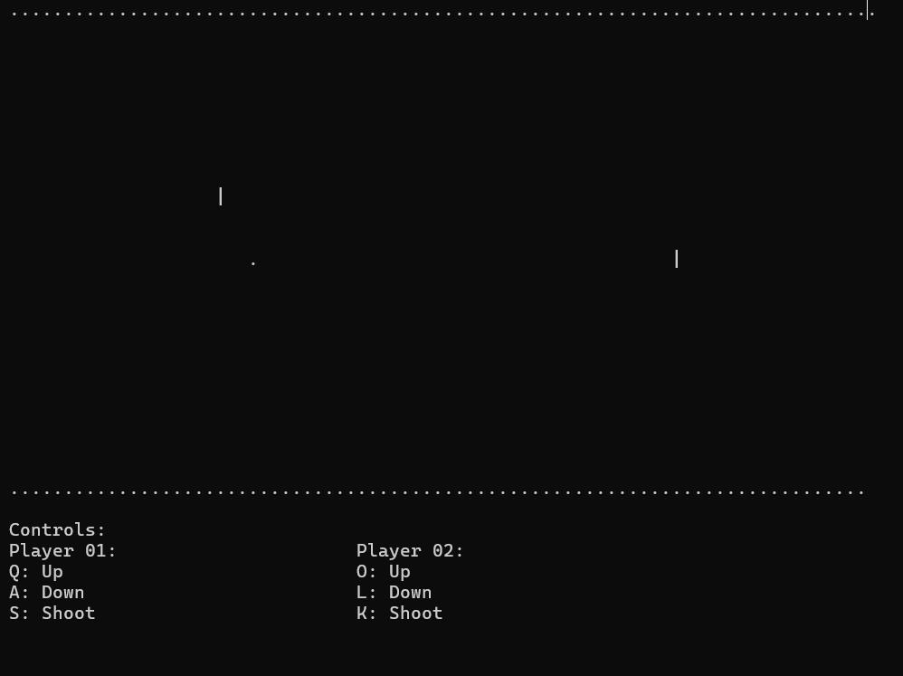

# 🔫 Console-Based Two-Player Shooting Game (C++)

A fast-paced, two-player shooting game built in C++ for the Windows console. Players can move up/down, shoot bullets, and try to hit their opponent to win. Built using `windows.h`, `conio.h`, and basic console rendering.

---

## 🎮 Game Overview

This project simulates a retro-style side-view shooting duel between two players, using ASCII graphics in a Windows terminal.

- Each player moves vertically.
- Players fire bullets that move horizontally.
- Two bullet types supported per player.
- Game ends when a bullet hits the opponent.
- Real-time keyboard interaction using low-level Windows input handling.

---

## 🕹️ Controls

| Player        | Move Up | Move Down | Shoot |
|---------------|---------|------------|--------|
| **Player 1**  | `Q`     | `A`        | `S`    |
| **Player 2**  | `O`     | `L`        | `K`    |
| **Exit Game** | `Esc`   | —          | —      |

---

## ⚙️ Features

- Real-time input handling using `ReadConsoleInput`
- Bullets with directional travel and second-shot launch
- Collision detection and win condition
- Console-based ASCII graphics
- Multiplayer on one keyboard

---

## 💻 Requirements

- **Platform:** Windows
- **Language:** C++
- **Compiler:** Any C++ compiler supporting `windows.h` and `conio.h` (Code::Blocks, MinGW, Visual Studio)

---

## 💾 Source Code

All source code is available in the `code/` directory:

- [`shooting_game.cpp`](code/shooting_game.cpp)

---

## 📸 Demo

A screenshot of the game in action:

---

## 👤 Author

- [Aleeza Rizwan]((https://github.com/its-aleezA))

---

## 🔖 License

This project is licensed under the MIT License.
See the [LICENSE](LICENSE) file for full details.
